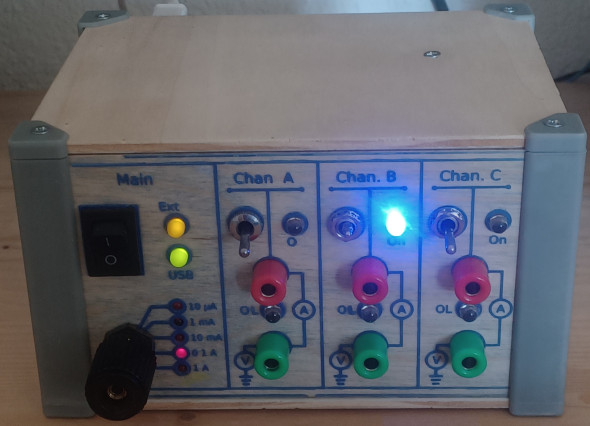

<p align="center">
	
</p>

<h1 align="center">TriPico PSU</h1>

<p align="center">
	
	
	
	
</p>

<p align="center">
	<a href="hardware/README.md"></a>
	<a href="firmware/README.md"></a>
	<a href="software/README.md"></a>
</p>

> A 3-channel Raspberry Pi Pico instrument that works as a programmable power supply, bench voltmeter/ammeter, and YAML-driven curve tracer all in one.

---

## ⚡ What Is This?

TriPico PSU is a 3-channel instrument built around a Raspberry Pi Pico and dual INA3221 measurement ICs. It can be configured as:

- **Programmable multi-channel power supply** — independent voltage/current regulation on 3 channels with max power limits
- **Live voltmeter/ammeter front end** — real-time monitoring with interactive desktop GUI and live charts
- **Curve tracer** — automated characterization of transistors, diodes, and components using YAML recipe automation

### Repository Structure

- **[hardware/README.md](hardware/README.md)** — PCB schematic, PCB layout, front-panel design, and wiring integration
- **[firmware/README.md](firmware/README.md)** — Raspberry Pi Pico firmware (MicroPython async control loop)
- **[software/README.md](software/README.md)** — Host computer application (interactive GUI + YAML automation)



### Picture Insertion Block: Full Build Overview

Use this block when you have a cleaner hero photo than global_view.jpg.

```md

```

---

## 🎯 How It Works

The Pico firmware regulates 3 channels independently, continuously reads voltage/current through dual INA3221 sensors, and streams measurements over serial at 115200 baud. On the computer side, you have two modes:

- **Interactive GUI mode** — real-time control and monitoring with live voltage/current charts
- **YAML automation mode** — scripted sweeps, static test runs, CSV export, and optional plots

---

## 🚀 Build And Run (Step By Step)

### 1) Build The Hardware

### Picture Insertion Block: Build Steps Collage

Add one image showing PCB + panel + enclosure parts before assembly.

```md

```

1. Open the KiCad files and fabricate/assemble the PCB.
2. Build the front panel/enclosure from the provided enclosure assets.
3. Wire the panel elements (switches, relays, connectors, LEDs) to the PCB.

Detailed files and notes are in [hardware/README.md](hardware/README.md).

### 2) Flash The Pico Firmware

### Picture Insertion Block: Pico Flashing

Show your firmware upload workflow or MicroPython file layout.

```md

```

1. Copy all files from the firmware folder to the Pico:
	 - config.py
	 - device.py
	 - ina3221.py
	 - main.py
2. Reboot the board and verify serial output appears.

Firmware details are in [firmware/README.md](firmware/README.md).

### 3) Set Up The Computer Software

### Picture Insertion Block: Software Setup

Optional terminal screenshot after successful dependency install.

```md

```

1. Create a Python virtual environment.
2. Install dependencies from software/requirements.txt.
3. Configure software/tripico-psu_config.yaml for your serial port and calibration folder.

Software details are in [software/README.md](software/README.md).

### 4) Use It

### Picture Insertion Block: First Run

Add one screenshot with the GUI connected and channels active.

```md

```

- GUI mode (interactive bench use):
	- Run software/tripico-psu_gui.py
	- Connect to the Pico
	- Set channel mode (V or mA), setpoint, and max power

- YAML mode (automation and characterization):
	- Run software/tripico-psu_run_yaml.py with one YAML recipe from software/examples
	- Capture sweeps/static runs to CSV and optional plots

---

## 📊 Typical Practical Uses

### Standalone power supply behavior

### Picture Insertion Block: Power Supply Mode

```md

```

- Set channels in voltage or current mode
- Apply max-power protection per channel
- Monitor live values and status (regulation/saturation/alerts)

### Digital voltmeter/ammeter style usage

### Picture Insertion Block: Meter Mode

```md

```

- Use one or more channels as sensing points
- Observe time-series voltage/current in the GUI
- Switch measurement range from the front panel selector

### Curve tracer usage

### Picture Insertion Block: Curve Tracer Plot

```md

```

- Define nested sweeps in YAML (for example transistor curves)
- Plot I-V behavior in real time
- Export data for offline analysis

## Example Screens

- GUI examples:
	- [docs/pictures/gui.png](docs/pictures/gui.png)
	- [docs/pictures/gui2.png](docs/pictures/gui2.png)

## Current Status

This repository already contains working code and build assets. Hardware assembly details are intentionally partial and should be completed with your own wiring/BOM documentation as you finalize your build.