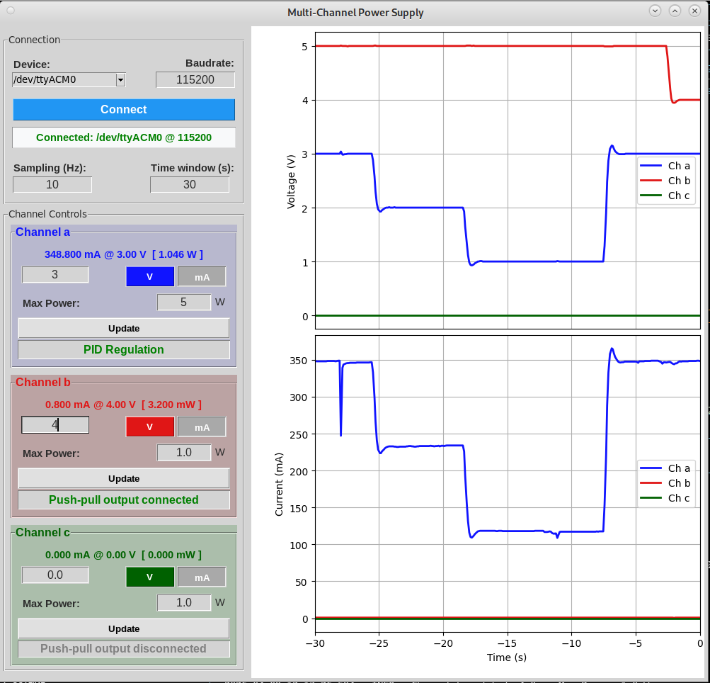

# ⚡ TriPico PSU: 3-Channel Raspberry Pi Pico Power Supply, Meter, and Curve Tracer

By <your-name>

> A compact bench instrument that combines a programmable 3-channel power supply, live voltmeter/ammeter interface, and YAML-driven curve tracer — all powered by a Raspberry Pi Pico and dual INA3221 measurement ICs.


---

## 🛠️ Supplies

### Electronics

- 1x Raspberry Pi Pico (RP2040)
- 2x INA3221 modules (or equivalent on-board implementation)
- Channel control and output stage components from the KiCad design
- Range selector switch and shunt network
- Safety relays (one per channel)
- Front panel switches, LEDs, and binding posts
- External DC input connector
- Wiring, headers, terminals

### Build Tools

- Soldering iron and solder
- Multimeter
- Wire stripper/cutter
- Small screwdriver set
- PC with USB connection

### Fabrication Tools (Optional)

- PCB fabrication service (Gerbers from KiCad)
- Laser/CNC/3D workflow for panel and enclosure parts


---

## 🔨 🎯 What You'll Make

TriPico PSU has three regulated channels: A, B, and C.

- Firmware reads voltage and current continuously
- Firmware regulates each channel in voltage mode or current mode
- Safety logic opens relays if voltage/current/power limits are exceeded
- Host app receives live data over serial and plots it
- YAML runner can execute nested sweeps for device characterization

Use cases:

- Standalone power source for test circuits
- Precision monitoring instrument for current/voltage behavior
- Curve tracer for transistor/FET/source characterization


---

## 🔨 Step 2: Build or Order the PCB

Open the hardware design in KiCad:

- hardware/kicad/tripico-psu.kicad_sch
- hardware/kicad/tripico-psu.kicad_pcb

Then:

1. Run ERC/DRC
2. Generate Gerbers and drill files
3. Assemble the board
4. Check continuity before first power-up

Important:

- Keep high-current paths short and thick
- Keep analog sensing paths clean and well-grounded
- Verify there is no short between power rails


---

## 🔨 Step 3: Prepare the Front Panel and Enclosure

Panel assets are already included:

- hardware/enclosure/front_panel_inkscape.svg
- hardware/enclosure/front_panel_polygon.svg
- hardware/enclosure/front_panel.scad

Fabrication flow:

1. Adjust labels/hole positions in SVG if needed
2. Generate panel geometry from SVG/SCAD
3. Cut/print panel and mount all controls

Suggested panel elements:

- Main power switch
- Channel A/B/C push-pull toggles
- Ammeter range selector
- Output terminals
- Status LEDs


---

## 🔨 Step 4: Wire the Hardware

Wire panel and board using the KiCad net names as reference.

Minimum wiring checklist:

- Power input and ground
- Channel outputs A/B/C
- Relay control lines
- Push-pull switch inputs
- Range selector lines
- LED indicators

Best practice:

- Route signal and power wiring separately where possible
- Label each harness
- Do a final continuity pass before applying full power


---

## 🔨 Step 5: Flash the Pico Firmware

Copy these files from the firmware folder to your Pico:

- config.py
- device.py
- ina3221.py
- main.py

Then reboot.

At startup, firmware:

- Initializes INA3221, GPIO, PWM, UART
- Starts regulation and serial tasks
- Begins streaming measurements


---

## 🔨 Step 6: Set Up the PC Software

From the software folder:

```bash
python -m venv venv
venv\\Scripts\\activate
pip install -r requirements.txt
```

Edit software/tripico-psu_config.yaml:

- Serial device path
- Channel list
- Calibration folder
- GUI defaults


---

## 🔨 Step 7: Run in GUI Mode (Interactive Control)

Start the live application:

```bash
python software/tripico-psu_gui.py
```

Workflow:

1. Connect to serial port
2. Set each channel to V or mA mode
3. Set setpoint and max power
4. Monitor live current/voltage plots

This mode is ideal for bench use and interactive tuning.



---

## 🔨 Step 8: Run in YAML Automation Mode (Curve Tracer)

Start a characterization run:

```bash
python software/tripico-psu_run_yaml.py software/examples/npn_output_characteristics.yaml -device /dev/ttyACM0 -baud 115200
```

What you get:

- Automatic sweep/static execution
- CSV export
- Optional plot generation

Great for repeatable transistor/FET/source measurements.


---

## 🔨 Step 9: Calibration and Safety Checks

Before regular use:

- Verify each ammeter range
- Validate offsets and coefficients in your calibration folder
- Confirm relay cut-off behavior on over-limit conditions
- Test emergency recovery path

Safety reminders:

- Use fused external power input
- Never bypass relay protection
- Keep moisture away from electronics


---

## ✨ Results and Practical Use

TriPico PSU now works as:

- A programmable 3-channel supply for prototypes
- A live multi-channel meter
- A compact curve tracer for characterization work

If you build one, share your photos and your wiring/BOM improvements.


---

## 📁 Project Files

- Main overview: README.md
- Hardware guide: hardware/README.md
- Firmware guide: firmware/README.md
- Software guide: software/README.md

All source files and project assets are in this repository.